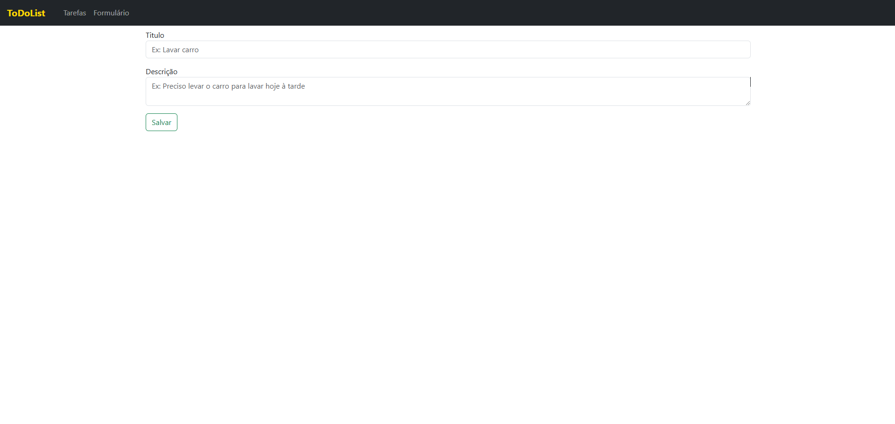

# PROJETO GERENCIADOR DE TAREFAS

## 📖 Sobre o projeto

- Criação de um gerenciador de tarefas com vue.js usando o bootstrap vue.

## 🔨 Tecnologias utilizadas

- [Javascript](https://developer.mozilla.org/pt-BR/docs/Web/JavaScript)
- [Vue](https://vuejs.org/)
- [BootstrapVue](https://bootstrap-vue.org/)

## Pré-requisitos:

- Node.Js

## ♻️ Como executar o projeto

```
npm install
```

```
npm run serve
```

## 🖼️ Imagens do projeto


<hr />



<hr />


<hr />

## 🛎️ License

[](https://github.com/jefersoniw/atendimento_nodejs/blob/main/LICENSE)

## 🤓 Autor

### Jeferson Chagas Silva

### https://jefersoniw.github.io/portfolio/

### https://www.linkedin.com/in/jefersoniw/
